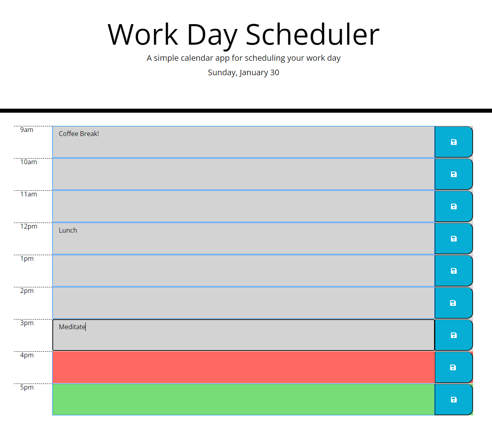

# Work Day Scheduler Starter Code

## The Motivation

During this project, I really got to understand bootstrap and moment js a lot deeper. It showed me how to manipulate the DOM based on time. Also, I grew my understanding of local storage by setting/getting data that you add to the scheduler.

## Challenges

One challenge I faced was setting local storage on each hour of the day individually. There are 9 rows in this scheduler and getting them to have their own key took time to figure out. To continue, getting moment to loop over the hours and making it the appropriate color in terms of past, present, and future was difficult. All in all, a great project to grow my javascript skills.

## Screenshot

## Link
https://itzguled.github.io/work-day-scheduler/